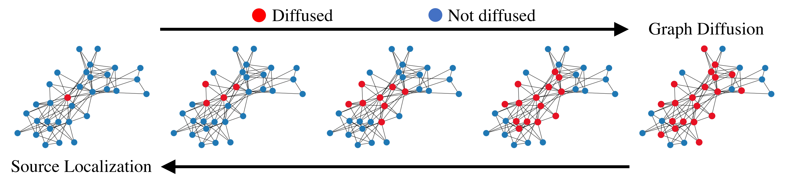

# PGD: Improving Source Localization by Perturbing Graph Diffusion

In this repository we provide code of the paper:
> **Improving Source Localization by Perturbing Graph Diffusion**

> Yaping Zhao, Zhongrui Wang, Edmund Y. Lam

> paper link: https://ieeexplore.ieee.org/abstract/document/10032349

<p align="center">

</p>

Our code is implemented by some modifications based on the repository [IVGD](https://github.com/xianggebenben/IVGD). Sincere gratitude to IVGD.

## Requirement
```
scipy==1.5.0

torch==1.6.0

ipdb==0.13.4

numpy==1.18.5

scikit_learn==0.23.2
```

### Datasets and Pre-trained models
The datasets and pre-trained models are available at [OneDrive](https://connecthkuhk-my.sharepoint.com/:f:/g/personal/zhaoyp_connect_hku_hk/EsxXVLR0NddHtf7ieAV__gABBy65h4pWEpUOIg6YF7Jzkw?e=Mh3zg1) 
and [Baidu Netdisk](https://pan.baidu.com/s/1Y4fJDquiE8GZJIvTsdScZA) (password: m0he).

Download them into this project folder, where the directory structure should be:
- PGD/
    - data/
    - model/
    - ...

## Usage
To reproduce the main results from our paper, simply run:
```
python search_noise.py
```

## Citation
Cite our paper if you find it interesting!
```
@inproceedings{zhao2022improving,
  title={Improving Source Localization by Perturbing Graph Diffusion},
  author={Zhao, Yaping and Wang, Zhongrui and Lam, Edmund Y},
  booktitle={2022 IEEE 9th International Conference on Data Science and Advanced Analytics (DSAA)},
  pages={1--9},
  year={2022},
  organization={IEEE}
}
```